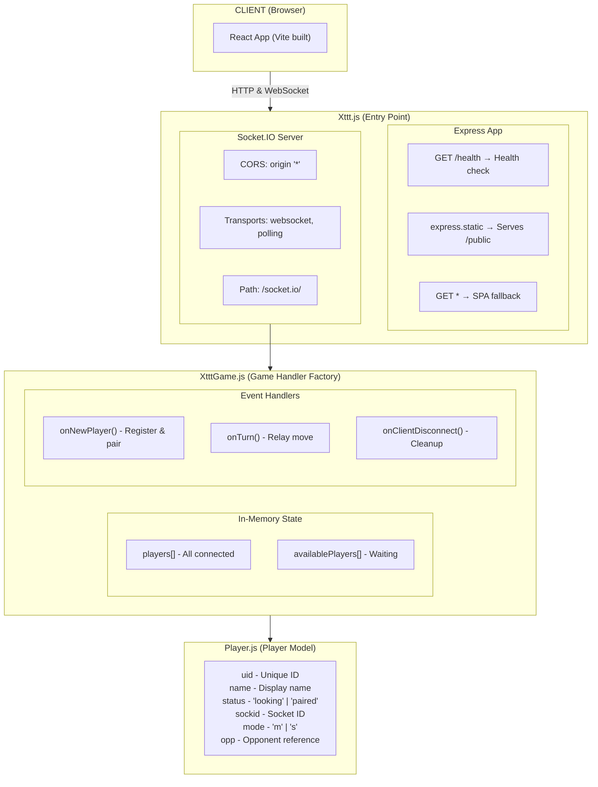
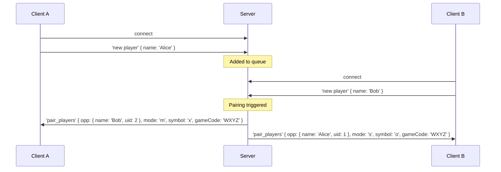
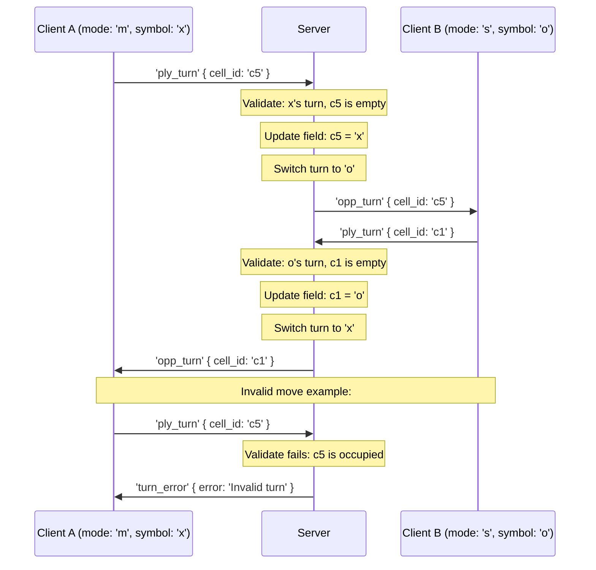
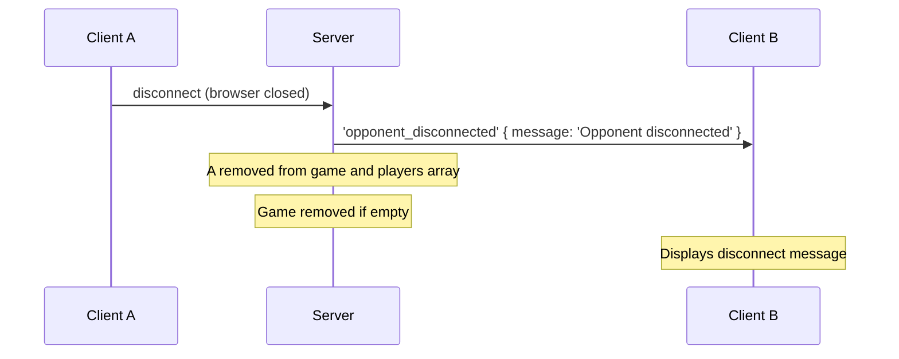
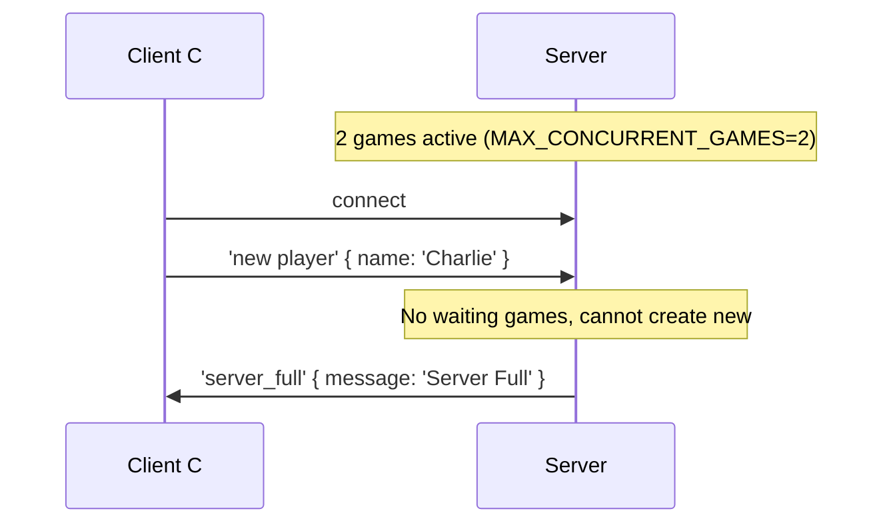

# WS — X Tic-Tac-Toe Socket Server

This document provides a comprehensive overview of the Node.js WebSocket server for the X Tic-Tac-Toe multiplayer game. It is intended for developers joining the project.

---

## Table of Contents

1. [Overview](#overview)
2. [Architecture Diagram](#architecture-diagram)
3. [Project Structure](#project-structure)
4. [Core Components](#core-components)
5. [Server Entry Point (Xttt.js)](#server-entry-point-xtttjs)
6. [Game Logic Handler (XtttGame.js)](#game-logic-handler-xtttgamejs)
7. [Player Model (Player.js)](#player-model-playerjs)
8. [Socket.IO Event Flow](#socketio-event-flow)
9. [Static File Serving](#static-file-serving)
10. [Configuration](#configuration)
11. [Deployment](#deployment)
12. [Development Guidelines](#development-guidelines)

---

## Overview

The WS server is a lightweight real-time game server built with:

| Technology | Purpose |
|------------|---------|
| **Node.js** | Runtime environment |
| **Express 4** | HTTP server & static file serving |
| **Socket.IO 4** | Real-time bidirectional WebSocket communication |

The server's primary responsibilities are:
- Serving the compiled React front-end as static files
- Managing WebSocket connections for real-time multiplayer gameplay
- Matching players into pairs (matchmaking)
- Relaying game moves between paired opponents

---

## Architecture Diagram



---

## Project Structure

```
WS/
├── Xttt.js           # Server entry point (Express + Socket.IO setup)
├── XtttGame.js       # Game logic & Socket.IO event handlers
├── Game.js           # Game class (server-side game state)
├── Player.js         # Player class/model
├── package.json      # Dependencies & npm scripts
├── Procfile          # Heroku/Render deployment config
├── __tests__/        # Jest test files
│   ├── Game-test.js
│   ├── Player-test.js
│   └── XtttGame-test.js
└── public/           # Static files served by Express
    ├── index.html    # SPA entry (compiled React app)
    ├── ws_conf.xml   # Runtime configuration
    ├── assets/       # Compiled JS/CSS bundles
    └── images/       # Static images
```

---

## Core Components

### 1. Xttt.js — Server Entry Point

**Purpose:** Initialize and configure the HTTP server, Express middleware, and Socket.IO.

**Key Architecture Decisions:**

| Decision | Rationale |
|----------|-----------|
| `http.createServer(app)` | Socket.IO attaches to the raw HTTP server, not Express |
| CORS `origin: '*'` | Allows connections from any origin (dev-friendly; restrict in production if needed) |
| Dual transports: `['websocket', 'polling']` | Ensures compatibility with hosting platforms (e.g., Render) that may have WebSocket limitations |
| Health check endpoint `/health` | Required by many PaaS providers for container health monitoring |
| SPA catch-all `app.get('*')` | Enables client-side routing (React Router) |

**Code Flow:**
```
1. Create Express app
2. Create HTTP server wrapping Express
3. Create Socket.IO server attached to HTTP server
4. Register static file middleware
5. Register game handlers via XtttGame.js
6. Start listening on PORT (env) or 3001
```

---

### 2. XtttGame.js — Game Logic Handler

**Purpose:** Manage player connections, matchmaking, and move relay.

**Architecture Pattern:** Factory function with closure-based state.

```javascript
module.exports = (io) => {
  const registerHandlers = createGame(io)  // Factory returns handler
  io.on('connection', registerHandlers)    // Handler registered per connection
}
```

**State Management:**

| Array | Contents | Purpose |
|-------|----------|---------|
| `players[]` | All Player instances | Track all connected users |
| `availablePlayers[]` | Players with status 'looking' | Queue for matchmaking |

**Matchmaking Algorithm (`pairAvailablePlayers`):**
1. Check if 2+ players are in `availablePlayers`
2. Pop first two players from queue (FIFO)
3. Assign modes: first player = `'m'` (master), second = `'s'` (slave)
4. Cross-reference opponents via `opp` property
5. Emit `pair_players` event to both with opponent info

**Event Handlers:**

| Handler | Trigger | Action |
|---------|---------|--------|
| `onNewPlayer` | `'new player'` event | Create Player, add to queues, attempt pairing |
| `onTurn` | `'ply_turn'` event | Forward `cell_id` to opponent via `'opp_turn'` |
| `onClientDisconnect` | `'disconnect'` event | Remove from arrays, re-queue opponent if paired |

---

### 3. Game.js — Game Model

**Purpose:** Server-side game state management with turn validation.

**Properties:**

| Property | Type | Description |
|----------|------|-------------|
| `code` | `string` | Random 4-letter game code (e.g., 'ABCD') |
| `field` | `object` | Board state (`c1`-`c9`, each `null`, `'x'`, or `'o'`) |
| `players` | `Player[]` | Array of 1-2 players in this game |
| `currentTurn` | `string` | `'x'` or `'o'` - whose turn it is |
| `status` | `string` | `'waiting'`, `'playing'`, or `'finished'` |

**Methods:**

| Method | Returns | Description |
|--------|---------|-------------|
| `addPlayer(player)` | `boolean` | Add player to game, assigns symbol/mode |
| `removePlayer(player)` | `void` | Remove player from game |
| `isFull()` | `boolean` | True if game has 2 players |
| `isEmpty()` | `boolean` | True if game has no players |
| `getOpponent(player)` | `Player\|null` | Get the other player |
| `makeTurn(player, cellId)` | `{valid, error?}` | Validate and apply a turn |

---

### 4. Player.js — Player Model

**Purpose:** Data class representing a connected player.

**Properties:**

| Property | Type | Description |
|----------|------|-------------|
| `uid` | `number` | Auto-incremented unique ID |
| `name` | `string` | Player's display name |
| `status` | `string` | `'looking'` or `'paired'` |
| `sockid` | `string` | Socket.IO socket ID |
| `socket` | `object` | (Legacy, unused) Socket reference |
| `mode` | `string` | `'m'` (goes first) or `'s'` (goes second) |
| `opp` | `Player\|null` | Reference to opponent |
| `game` | `Game\|null` | Reference to the Game instance |
| `symbol` | `string\|null` | `'x'` or `'o'` - player's symbol |

---

## Socket.IO Event Flow

### Connection & Matchmaking



### Gameplay (Move Relay with Server Validation)



### Disconnection Handling



### Server Full Scenario



---

## Static File Serving

The Express server serves compiled front-end assets from `WS/public/`:

```javascript
app.use(express.static(path.join(__dirname, 'public')))
```

**Production Deployment:**
1. Build React app in `react_ws_src/` → outputs to `dist/`
2. Copy `dist/*` to `WS/public/`
3. Copy `static/*` to `WS/public/`

**SPA Fallback:**
All non-API routes fall through to `index.html` to support React Router client-side routing:
```javascript
app.get('*', (req, res) => {
  res.sendFile(path.join(__dirname, 'public', 'index.html'))
})
```

---

## Configuration

### Runtime Configuration (ws_conf.xml)

Located at `public/ws_conf.xml`, fetched by the React client at startup.

Key settings:
- `<SOCKET__io u="..." />` — Override Socket.IO server URL (leave empty for same-origin)
- `<SCRIPT_ROOT u="..." />` — Base URL for the app

### Environment Variables

| Variable | Default | Description |
|----------|---------|-------------|
| `PORT` | `3001` | Server listening port |

---

## Deployment

### Heroku / Render (Procfile)

The `Procfile` specifies the web process:
```
web: node Xttt.js
```

### Manual Deployment Steps

1. Build front-end:
   ```bash
   cd react_ws_src && npm run build
   ```
2. Copy assets:
   ```bash
   cp -r dist/* ../WS/public/
   cp -r static/* ../WS/public/
   ```
3. Start server:
   ```bash
   cd WS && PORT=3001 npm start
   ```

### Process Management (Production)

For production, use a process manager like `forever` or `pm2`:
```bash
# Using forever (scripts in package.json)
npm run start:forever

# Using pm2
pm2 start Xttt.js --name "xttt-server"
```

---

## Development Guidelines

### Adding New Socket Events

1. Define the event handler in `XtttGame.js`:
   ```javascript
   const onMyEvent = (socket, data) => {
     // Handle event
   }
   ```

2. Register in the returned handler:
   ```javascript
   return (socket) => {
     // ... existing handlers
     socket.on('my_event', (data) => onMyEvent(socket, data))
   }
   ```

3. Document the event in this README.

### State Considerations

- **No persistence:** All state is in-memory. Server restart loses all connections.
- **Single instance:** Current design doesn't support horizontal scaling (no shared state).
- **UID generation:** Simple incrementing integer; resets on restart.

### Potential Improvements

| Area | Current State | Improvement |
|------|---------------|-------------|
| State persistence | In-memory | Add Redis for scaling |
| Authentication | None | Add JWT or session tokens |
| Room management | Auto-pair only | Add named rooms / invite links |
| Reconnection | Full reset | Implement session resumption |
| Logging | `util.log` | Use structured logging (Winston/Pino) |

---

## Dependencies

| Package | Version | Purpose |
|---------|---------|---------|
| `express` | ^4.19.2 | HTTP server & routing |
| `socket.io` | ^4.7.2 | Real-time WebSocket communication |

---

## Quick Reference

```bash
# Install dependencies
npm install

# Start server (development)
npm start

# Server listens on
http://localhost:3001

# Health check
curl http://localhost:3001/health
```
