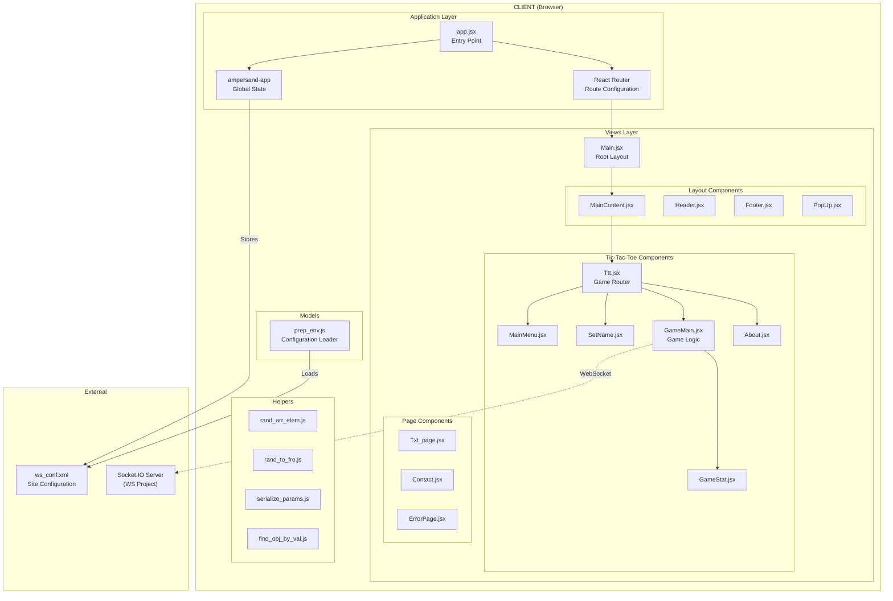
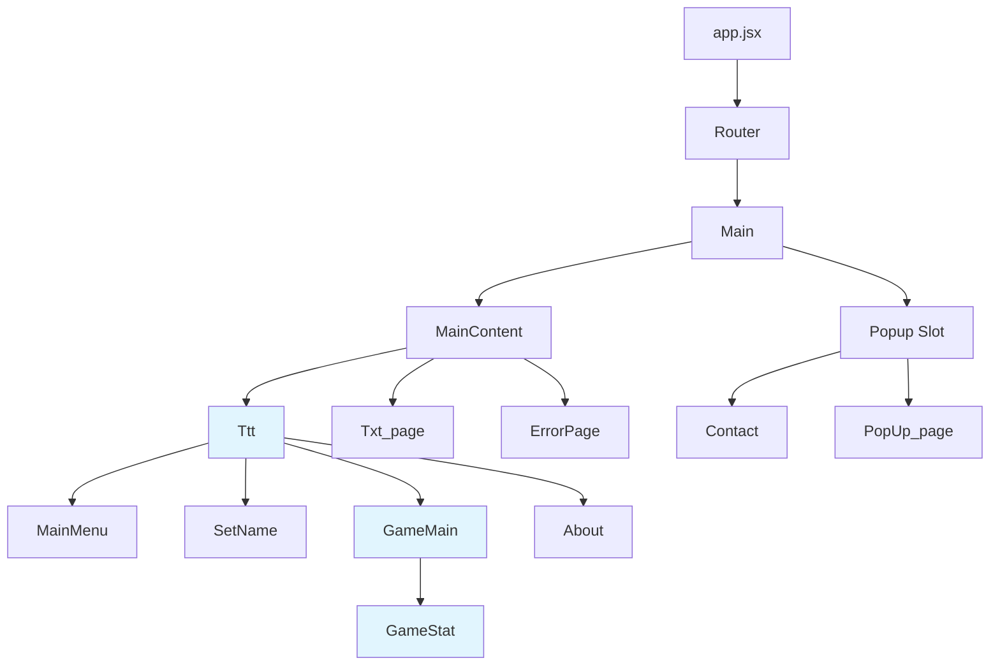
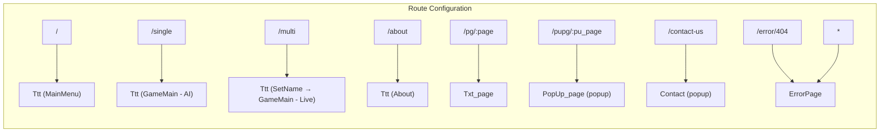
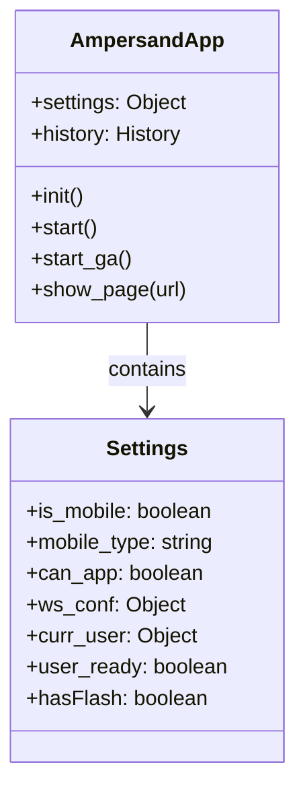
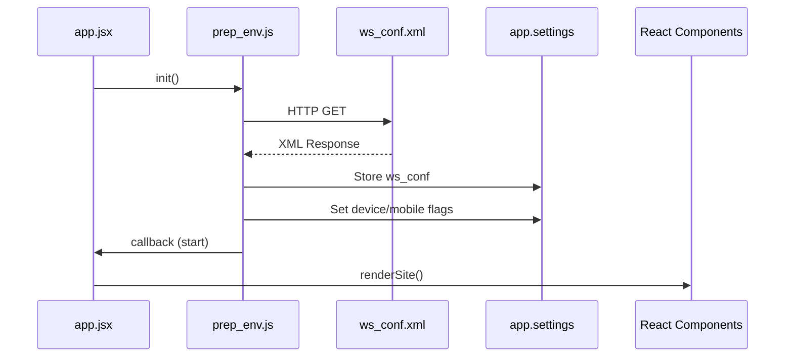
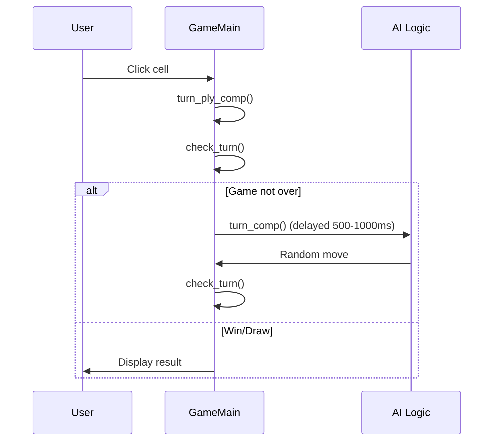
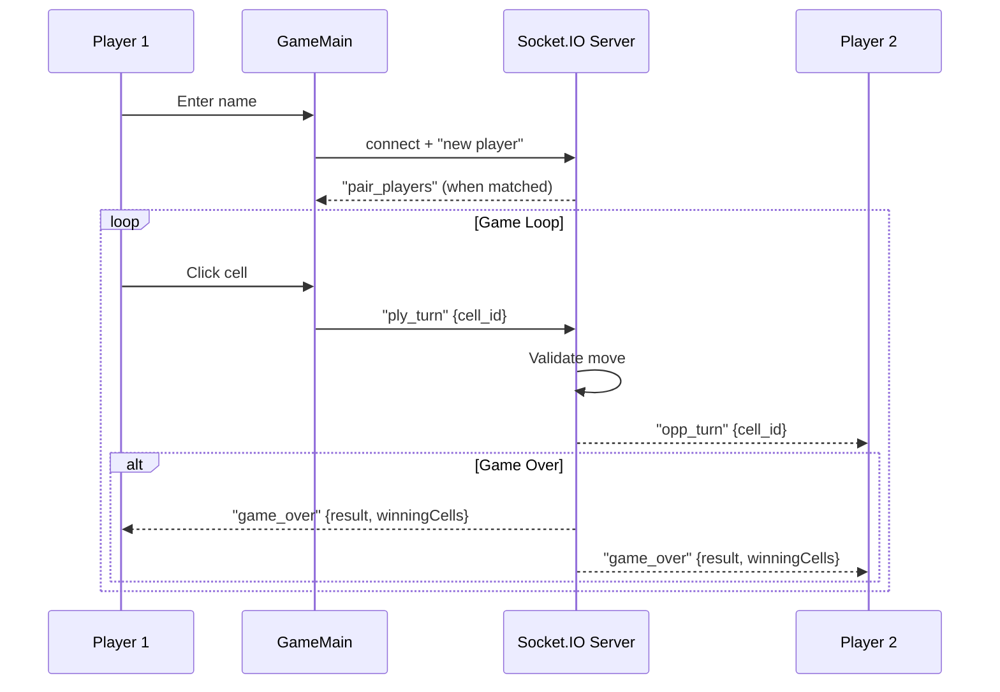

# X Tic-Tac-Toe — React Client

A comprehensive Tic-Tac-Toe game demo front-end built with the React.js stack. This application supports both single-player (vs AI) and multiplayer (via WebSocket) game modes.

---

## Table of Contents

1. [Overview](#overview)
2. [Technology Stack](#technology-stack)
3. [Architecture Diagram](#architecture-diagram)
4. [Project Structure](#project-structure)
5. [Component Hierarchy](#component-hierarchy)
6. [Routing Architecture](#routing-architecture)
7. [State Management](#state-management)
8. [Game Flow](#game-flow)
9. [WebSocket Communication](#websocket-communication)
10. [Configuration](#configuration)
11. [Getting Started](#getting-started)
12. [Suggested Improvements](#suggested-improvements)

---

## Overview

The React client provides a modern, responsive UI for playing Tic-Tac-Toe. Key features include:

| Feature             | Description                                        |
| ------------------- | -------------------------------------------------- |
| **Single Player**   | Play against a basic AI opponent                   |
| **Multiplayer**     | Real-time play against another human via WebSocket |
| **Persistent Name** | Player name saved to localStorage                  |
| **Animations**      | Smooth transitions using GSAP (TweenMax)           |
| **Analytics**       | Google Analytics integration                       |
| **Responsive**      | Mobile and desktop support                         |

---

## Technology Stack

| Technology           | Version | Purpose                            |
| -------------------- | ------- | ---------------------------------- |
| **React**            | 15.2.0  | UI framework                       |
| **React Router**     | 2.5.2   | Client-side routing                |
| **Vite**             | 4.x     | Build tool and dev server          |
| **Ampersand-app**    | 2.0.0   | Global application state singleton |
| **Socket.IO Client** | 4.7.2   | WebSocket communication            |
| **GSAP**             | 1.18.5  | Animations                         |
| **Sass**             | 1.69.x  | CSS preprocessing                  |
| **Jest**             | 29.7.0  | Unit testing                       |

---

## Architecture Diagram



---

## Project Structure

```
react_ws_src/
├── babel.config.cjs      # Babel configuration for Jest
├── devServer.js          # Legacy webpack dev server (deprecated)
├── index.html            # HTML entry point
├── jest.config.cjs       # Jest test configuration
├── package.json          # Dependencies and scripts
├── vite.config.mjs       # Vite build configuration
├── webpack.config.*.js   # Legacy webpack configs (deprecated)
│
├── src/
│   ├── app.jsx           # Application entry point & router setup
│   │
│   ├── helpers/          # Utility functions
│   │   ├── find_obj_by_val.js    # Find object in array by property value
│   │   ├── getBodyHeight.js      # Get document body height
│   │   ├── rand_arr_elem.js      # Get random array element
│   │   ├── rand_to_fro.js        # Generate random number in range
│   │   ├── serialize_params.js   # Serialize object to URL params
│   │   └── __tests__/            # Unit tests for helpers
│   │
│   ├── models/
│   │   ├── prep_env.js           # Environment/config preparation
│   │   └── __tests__/
│   │
│   ├── sass/                     # SCSS stylesheets
│   │   ├── main.scss             # Main stylesheet (imports all)
│   │   ├── ttt.scss              # Game-specific styles
│   │   ├── _variables.scss       # SCSS variables
│   │   ├── _mixins.scss          # SCSS mixins
│   │   ├── _normalize.scss       # CSS reset
│   │   └── _*.scss               # Component-specific partials
│   │
│   └── views/
│       ├── Main.jsx              # Root layout component
│       │
│       ├── layouts/              # Reusable layout components
│       │   ├── MainContent.jsx   # Main content wrapper
│       │   ├── Header.jsx        # Site header (navigation)
│       │   ├── Footer.jsx        # Site footer
│       │   ├── MessageBar.jsx    # Notification bar
│       │   └── PopUp.jsx         # Modal popup wrapper
│       │
│       ├── pages/                # Static page components
│       │   ├── Txt_page.jsx      # XML-driven text pages
│       │   ├── Contact.jsx       # Contact form
│       │   ├── PopUp_page.jsx    # Popup content wrapper
│       │   └── ErrorPage.jsx     # Error handling page
│       │
│       └── ttt/                  # Tic-Tac-Toe game components
│           ├── Ttt.jsx           # Game mode router
│           ├── MainMenu.jsx      # Main menu
│           ├── SetName.jsx       # Player name input
│           ├── GameMain.jsx      # Core game logic
│           ├── GameStat.jsx      # Game status display
│           ├── About.jsx         # About page
│           └── __tests__/
│
└── static/
    ├── ws_conf.xml               # Site configuration (XML)
    └── images/                   # Static images
```

---

## Component Hierarchy



---

## Routing Architecture



| Route             | Component                | Description              |
| ----------------- | ------------------------ | ------------------------ |
| `/`               | Ttt → MainMenu           | Main game menu           |
| `/single`         | Ttt → GameMain           | Single player vs AI      |
| `/multi`          | Ttt → SetName → GameMain | Multiplayer mode         |
| `/about`          | Ttt → About              | About page               |
| `/pg/:page`       | Txt_page                 | Dynamic XML-driven pages |
| `/pupg/:pu_page`  | PopUp_page               | Popup content pages      |
| `/contact-us`     | Contact                  | Contact form popup       |
| `/error/404`, `*` | ErrorPage                | Error handling           |

---

## State Management

The application uses **ampersand-app** as a global singleton for application-wide state:



### State Flow



---

## Game Flow

### Single Player (vs AI)



### Multiplayer (WebSocket)



---

## WebSocket Communication

### Events (Client → Server)

| Event        | Payload               | Description            |
| ------------ | --------------------- | ---------------------- |
| `new player` | `{ name: string }`    | Register as new player |
| `ply_turn`   | `{ cell_id: string }` | Submit a move (c1-c9)  |

### Events (Server → Client)

| Event                   | Payload                             | Description           |
| ----------------------- | ----------------------------------- | --------------------- |
| `pair_players`          | `{ opp, mode, symbol, gameCode }`   | Matched with opponent |
| `opp_turn`              | `{ cell_id: string }`               | Opponent made a move  |
| `game_over`             | `{ result, message, winningCells }` | Game ended            |
| `opponent_disconnected` | `{ message }`                       | Opponent left         |
| `server_full`           | `{ message }`                       | Server at capacity    |
| `turn_error`            | `{ error }`                         | Invalid move rejected |

---

## Configuration

Site configuration is loaded from `static/ws_conf.xml` at startup:

```xml
<data>
    <site>
        <vals year="2016" author="..." />
    </site>
    <conf>
        <ga_acc an="UA-XXXXX" />  <!-- Google Analytics -->
    </conf>
    <loc>
        <SOCKET__io u="wss://your-server.com" />  <!-- WebSocket URL -->
    </loc>
    <header>...</header>
    <footer>...</footer>
    <pgs>...</pgs>  <!-- Dynamic page content -->
</data>
```

---

## Getting Started

### Prerequisites

- Node.js >= 22.0.0
- npm

### Installation

```bash
npm install
```

### Development

```bash
npm run dev
```

Opens at [http://localhost:3000](http://localhost:3000)

### Testing

```bash
npm run test
```

### Linting

```bash
npm run lint
```

### Production Build

```bash
npm run build
```

Output to `dist/` folder.

---

## Suggested Improvements

### Critical / High Priority

1. **Upgrade React Version**

   - Current: React 15.2.0 (2016)
   - React 15 is significantly outdated and lacks modern features
   - Migrate to React 18.x for Concurrent Mode, Suspense, automatic batching
   - Replace deprecated `React.PropTypes` with the `prop-types` package

2. **Upgrade React Router**

   - Current: react-router 2.5.2 (deprecated API)
   - Migrate to react-router-dom v6 with modern hooks (`useNavigate`, `useParams`)

3. **State Management Modernization**

   - Replace `ampersand-app` singleton with modern alternatives:
     - React Context + useReducer for simpler state
     - Zustand or Jotai for lightweight global state
     - Redux Toolkit if complexity grows
   - Avoid direct state mutation (`this.state.cell_vals = ...`)

4. **Convert Class Components to Functional Components**
   - Use React Hooks (`useState`, `useEffect`, `useRef`, `useCallback`)
   - Improves readability and enables better code reuse

### Medium Priority

5. **TypeScript Migration**

   - Add type safety to catch errors at compile time
   - Improves IDE support and documentation

6. **Improve AI Logic**

   - Current AI is random; implement Minimax algorithm
   - Add difficulty levels (Easy, Medium, Hard)

7. **Remove Deprecated Dependencies**

   - Remove unused webpack configs
   - Update `gsap` to v3 (modern syntax)
   - Replace `x2js` XML parsing with JSON configuration

8. **Better Error Handling**

   - Add Error Boundaries for graceful UI failure
   - Improve WebSocket reconnection logic
   - Add user-friendly error messages

9. **Code Organization**

   - Split `GameMain.jsx` (568 lines) into smaller components
   - Extract game logic into custom hooks
   - Move Socket.IO logic to a dedicated service/hook

10. **Testing Improvements**
    - Add integration tests for game flow
    - Add component tests with React Testing Library
    - Increase test coverage (currently minimal)

### Low Priority / Nice-to-Have

11. **Accessibility (a11y)**

    - Add ARIA labels to game board cells
    - Keyboard navigation for game cells
    - Screen reader announcements for turns/results

12. **Performance Optimizations**

    - Memoize components with `React.memo`
    - Use `useMemo`/`useCallback` for expensive operations
    - Lazy load routes with `React.lazy`

13. **UX Improvements**

    - Add sound effects
    - Add game replay functionality
    - Show move history
    - Add player statistics/leaderboard

14. **Replace XML Configuration**

    - Use JSON or environment variables
    - Simplify configuration loading

15. **Mobile PWA Support**
    - Add service worker
    - Add manifest.json
    - Enable offline single-player mode

---

## License

This project is licensed under Creative Commons.

Originally created by **Maxim Shklyar** ([xims](https://github.com/xims/X-ttt)) at kisla interactive.
